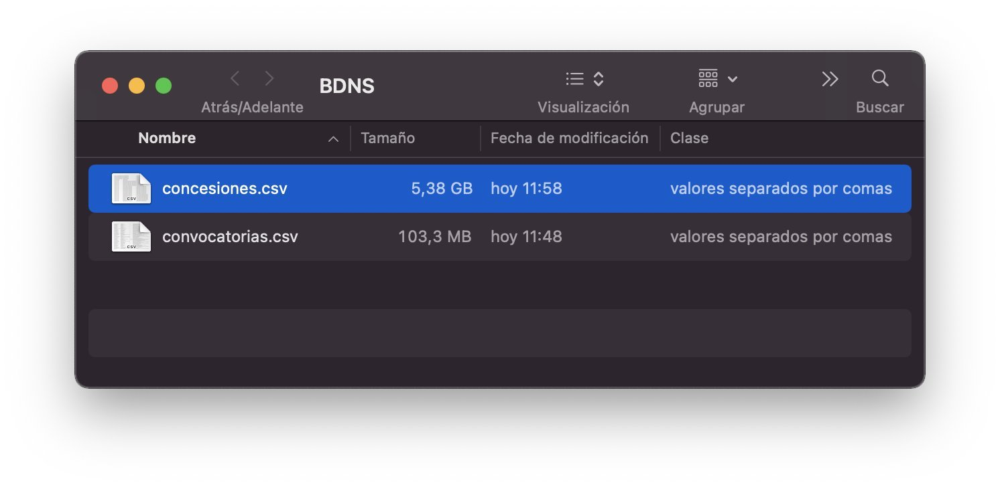
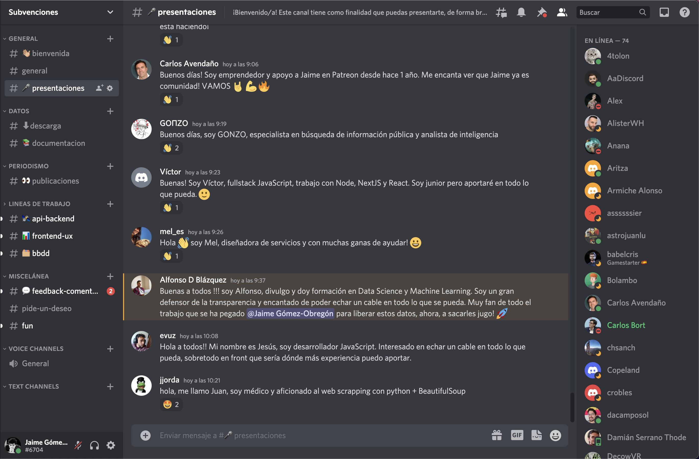

# Subvenciones

> [!NOTE]
> 🚧 **Este proyecto ha sido archivado y ya no se aceptan contribuciones.**
>
> Por una parte, el Ministerio de Hacienda ha renovado el portal de la Base de
> Datos Nacional de Subvenciones y ahora permite descargar los datos; algo que
> no era posible cuando lancé este proyecto en 2022.
>
> Lo expresado en este proyecto ya no tiene aplicación en el nuevo portal de
> subvenciones.
>
> Esta iniciativa —por lo que he oído— parece que tuvo algo que ver en ese
> movimiento del Ministerio…
>
> Por otro lado, quiero agradecer de corazón la respuesta de la comunidad.
> El servidor de Discord llegó a reunir **cerca de un millar de personas**
> entusiastas, dispuestas a ayudar y a colaborar. Fue algo que me superó.
>
> Hice lo que pude, pero la magnitud de la respuesta me sobrepasó. No supe
> cómo organizar a tanta gente ni cómo mantener el ritmo sin desatender otras
> áreas de mi vida. Llegué incluso a buscar a alguien que pudiera asumir la
> coordinación de la comunidad, pero no logré encontrar a la persona adecuada.
>
> Confieso con humildad que me sentí abrumado y que, al final, no fui capaz de
> liderar esta iniciativa tanto como habría querido. Aun así, me alegra que
> sirviera para abrir un debate público y para inspirar algunos hilos virales
> en Twitter (ahora X) que arrojaron luz sobre las subvenciones públicas en
> España.
>
> Queda el proyecto archivado como referencia y como testimonio de aquel
> intento colectivo de mejorar la transparencia pública.
>
> Gracias a todos los que lo hicisteis posible 🙏

[Read in English](README_en.md)

Un reto con la Base de Datos Nacional de Subvenciones (BDNS).

|              |                                                                      |
| ------------ | -------------------------------------------------------------------- |
| GitHub       | <https://github.com/JaimeObregon/subvenciones>                       |
| Discord      | <https://discord.gg/r2ytSa782D>                                      |
| Idea inicial | <https://twitter.com/JaimeObregon/status/1507693311422877697> (hilo) |

## El punto de partida

El Ministerio de Hacienda y Función Pública de España, a través de la Intervención General de la Administración del Estado, opera el [Sistema Nacional de Publicidad de Subvenciones y Ayudas Públicas](https://www.infosubvenciones.es). Se trata, telegráficamente, de un portal web que recoge las convocatorias y concesiones de subvenciones públicas.

Este portal es una iniciativa en favor de la transparencia, pero tiene notables limitaciones.

## El problema

El portal oficial proporciona una interfaz cutre de acceso a unos datos que, sin embargo, son de alto valor para la transparencia:

1. **La búsqueda es rudimentaria**, con una experiencia de usuario mejorable. El portal aparentemente no permite usos simples tales como, por ejemplo, reunir y explorar la totalidad de las subvenciones concedidas a un beneficiario dado. Y la ergonomía del sistema es pobre, con un interfaz de usuario tedioso, enlaces que caducan y que por lo tanto no se pueden guardar ni compartir…

1. **La consulta de los datos es muy lenta.** La mera carga de una página arbitraria de concesiones puede suponer esperar más de dos minutos. Esto dinamita el acceso de la ciudadanía a los datos públicos, pues en la práctica la consulta es tan lenta que se hace imposible. El ciudadano tira la toalla.

1. **No se pueden descargar los datos.** Se pueden hacer descargas parciales, pero el portal no proporciona un mecanismo para la descarga de la totalidad del conjunto de datos. Esto impide una exploración _offline_ del conjunto de datos y la aplicación de métodos avanzados de análisis.

## El reto

¿Podemos, como sociedad civil, hacerlo mejor? ¿Podemos, como país, dotarnos de un instrumento mejor para el acceso y la publicidad de estos datos públicos, para el control de la actuación de nuestros gestores?

El reto de este proyecto consiste en:

1. [x] **Obtener los datos.** Encontrar la manera de descargar todos los datos del portal oficial del Ministerio y reunirlos en un lugar común y de fácil acceso para poder trabajarlos con la finalidad expresada.

   Aplicando [este método de descarga](https://twitter.com/JaimeObregon/status/1508880926587056128) se han obtenido 10,5 millones de concesiones de subvenciones en unas 350.000 convocatorias. Los datos se encuentran en el directorio [`/files`](/files) de este repositorio.

   

1. [x] **Articular una comunidad** heterogénea de personas interesadas en este reto desde sus diferentes perspectivas: analistas de datos, programadores, diseñadores de producto, abogados y especialistas en protección de datos, funcionarios de órganos de tramitación de subvenciones…

   La comunidad tiene dos espacios: [el servidor `Subvenciones` en Discord](https://discord.gg/r2ytSa782D) y [el repositorio `JaimeObregon/subvenciones` en GitHub](https://github.com/JaimeObregon/subvenciones).

   

1. [ ] **Construir una herramienta digital** complementaria a la oficial pero carente de sus limitaciones, y que faculte a la ciudadanía para explorar de forma eficaz y creativa las actuaciones de los gestores públicos.

   Y hacerlo de forma cooperativa, reuniendo esfuerzos y capacidades en torno a un proyecto colaborativo de software libre y código abierto al que todo aquel que lo desee puede asomarse y contribuir.

## Cómo contribuir

`[WIP]`

- **Si eres un programador** …

- **Si eres un especialista en ayudas públicas** …

- **Si eres un diseñador** …

- **Si eres un trabajador de la Administración Pública**, como por ejemplo un interventor, puedes contarnos cómo …

- **Si eres un periodista o investigador** …

- **Si eres un especialista en protección de datos** …

- **Si eres un abogado** …

- **Si eres otra cosa**, ¡adelante! Echa un vistazo, observa y participa como desees.

## Próximos pasos

`[WIP]`

1. Terminar esta introducción.

1. Organizar alemanamente los siguientes pasos.

1. El repositorio puede sacarse del GitHub de JaimeObregon y moverse a otro más neutro, para que el proyecto no esté asociado al nombre de nadie en particular.

## Marco legal

`[WIP]`

…

## Participantes

¡Tensa tu arco, desentierra tu hacha, participa y añade tu nombre de guerra! 😄

- Jaime Gómez Obregón ([@JaimeObregon](https://twitter.com/jaimeobregon)), _scraping_ de los datos y propuesta inicial.
- JuanMa Cuevas ([@juanmacuevas](https://twitter.com/juanmacuevas)), programador python & android. _hacktivista_ aficionado.
- Yago F. ([@yaguetoo](https://github.com/yagueto)), programador Python y Java.
- Pedro J. Molina ([@pjmolina](https://github.com/pjmolina)), programador TypeScript, Docker y dotNet.
- Álvaro Díaz. ([@Paquito86](https://github.com/Paquito86)), Ingeniero DevOps Junior.
- José Ordaz. ([@JoseOrdaz](https://github.com/JoseOrdaz)), Junior FrontEnd Developer.
